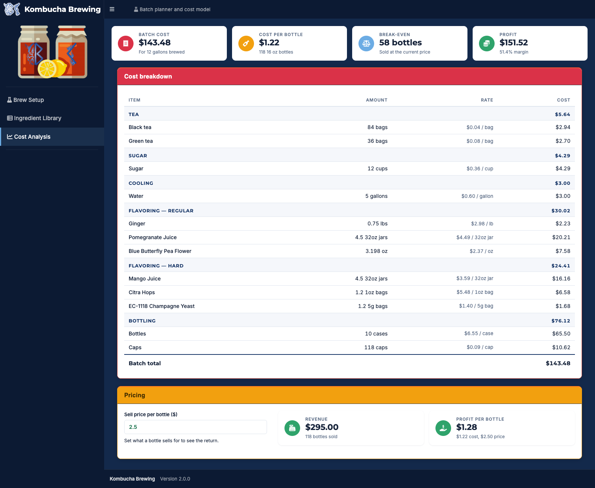

# Kombucha Brewing

Plan a batch of kombucha and find out what it costs you.

Set your batch size and recipe, and the app works out how much tea, sugar, and
flavoring you need, how many bottles you will fill, what the whole batch costs,
and what you make selling it.



## Running it

The app is deployed at https://kylebarrett.shinyapps.io/Kombucha/

To run it yourself, open the project in RStudio and run:

```r
renv::restore()
shiny::runApp()
```

`renv::restore()` installs the exact package versions the app was built
against, and only needs running the first time.

## Using it

**Brew Setup** is where you describe the batch.

Start with the batch size and the starter ratio -- the share you carry over
from your last batch. Everything else scales off what is left, since that is
the volume you actually brew.

The three tabs below follow the brew:

- **F1 Ingredients** -- tea, sugar, and whether you cool with water or ice.
  Enter prices the way you paid them (a box of 600 tea bags for $21.00) and the
  app works out the per-bag rate.
- **F2 Flavoring** -- choose regular kombucha, hard, or a split of both, then
  pick flavorings for each. Amounts scale with how much of each style you make.
- **Bottling** -- bottle size and how much juice goes in each one. Bottles are
  priced by the case, caps individually.

Each tab totals its own costs as you go.

**Cost Analysis** puts the whole batch together: what it cost, broken down by
stage, and what you make at a given sell price -- including how many bottles
you need to sell to break even.

**Ingredient Library** is the list of flavorings you can choose from.
Double-click any cell to change an amount or a price, and the batch re-prices
straight away. Add and delete rows as your shelf changes. Changes only last the
session until you hit **Save library**, and **Restore defaults** puts the
original list back. **Download CSV** gives you a copy to keep or share.

## Development

Run the tests from the R console:

```r
testthat::test_dir("tests/testthat")
```

The browser tests need Chrome installed.
